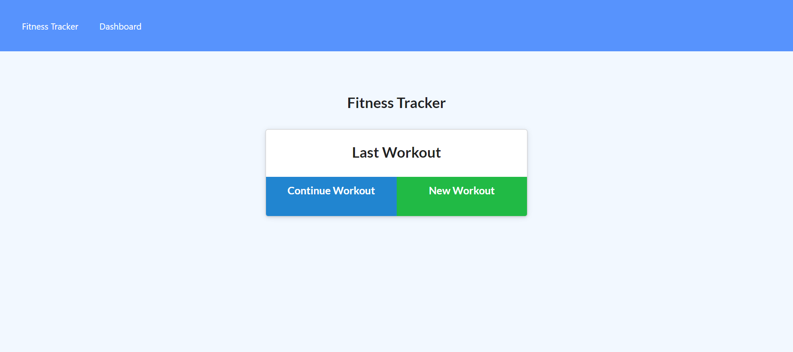

# Workout Tracker

## Description

This application allows the user to create a record of workouts, with the history for the user being stored via MongoDB. There is also a dashboard feature that provides a summary of the current user's workouts.

## Visuals

See image below for workout tracker platform:

## Links

Please find the deployed application here: https://workout-tracker-ss.herokuapp.com/
